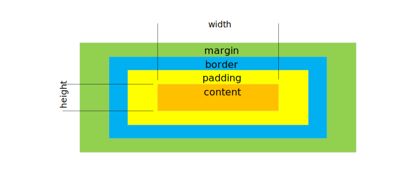

# CSS 模型相关

1. [CSS 盒模型](#CSS-盒模型)
2. [绘制 0.5px 的线](#绘制-05px-的线)
3. [绘制三角型](#绘制三角型)

## CSS 盒模型
* IE 盒模型


width表示 content + padding + border三个部分的宽度和,
盒子模型宽度为 width  

* W3C 标准盒模型



width表示 content 部分的宽度,
盒子模型宽度为 border-left + padding-left + width + padding-right + border-right  

CSS3中引入了box-sizing属性
1. box-sizing:content-box,表示标准的盒子模型;  
2. box-sizing:border-box,表示的是IE盒子模型;  
3. box-sizing:padding-box,这个属性值的宽度为 padding-left + width + padding-right.  

* 背景色的填充区域
background-color 的填充区域包含元素的content,padding,border区域。

## 绘制 0.5px 的线
* 直接设置 0.5px
```CSS
.half-px{ 
  height: 0.5px;
}
```
* 使用缩放
```CSS
.scale-half{
  height: 1px;
  transform: scaleY(0.5);
}
```
* 使用box-shadow
```CSS
.boxshadow-half{
  height: 1px;
  background: none;
  box-shadow: 0 0.5px 0 #000;
}
```
* 使用 SVG
```CSS
.svg-half{
  background: none;
  height: 1px;
  background: url("data:image/svg+xml;utf-8,<svg xmlns='http://www.w3.org/2000/svg' width='100%' height='1px'><line x1='0' y1='0' x2='100%' y2='0' stroke='#000'></line></svg>")
}
```
* 设置 viewport
``` HTML
<meta name="viewport" content="width=device-width, initial-sacle=0.5">
```

## 绘制三角型
* 实心三角型
```CSS
.test{
  width: 0;
  height: 0;
  border-width: 0 50px 50px 50px;
  border-style: solid;
  border-color: transparent transparent #66CCFF  transparent;
}
```
* 箭头
```CSS
.test {
  position: relative;
  width: 0;
  height: 0;
  border-width: 0 50px 50px 50px;
  border-style: solid;
  border-color: transparent transparent #66CCFF transparent;
}
.test:before {
  content: '';
  display: block;
  position: absolute;
  top: -49px;
  left: -50px;
  border-width: 50px;
  border-style: solid;
  border-color: transparent transparent #FFFFFF transparent;
}
```