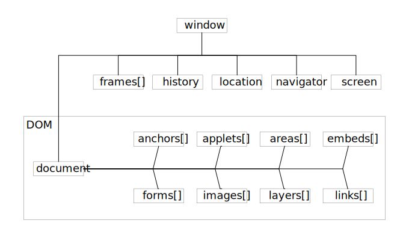

# BOM

## 什么是BOM
* BOM,Browser Object Model,即浏览器对象模型。浏览器页面初始化时,会在内存创建一个全局对象,用来描述当前窗口的属性和状态,这个全局对象被称为浏览器对象模型。
* 不同于DOM的标准化组织是W3C,JavaScript的语法标准化组织是ECMA,BOM没有官方标准,它最初是Netscape浏览器标准的一部分,也就是说,对于现代浏览器,每个浏览器都有自己的BOM实现方法,所以直接使用BOM会有兼容性问题。

window对象是BOM的顶层(核心)对象,不是JS对象,所有对象都是通过它延伸出来的,也可以称为window的子对象。
JavaScript是通过访问BOM对象来访问、控制、修改客户端(浏览器),由于BOM的window包含了document,window对象的属性和方法是直接可以使用而且被感知的,因此可以直接使用window对象的document属性,通过document属性就可以访问、检索、修改XHTML文档内容与结构
因为document对象又是DOM(DocumentObjectModel)模型的根节点。可以说,BOM包含了DOM(文档对象模型),浏览器提供出来给予访问的是BOM对象,从BOM对象再访问到DOM对象,从而js可以操作浏览器以及浏览器读取到的文档。

* BOM主要功能
1. 弹出新浏览器窗口的能力；
2. 移动、关闭和更改浏览器窗口大小的能力；
3. 可提供WEB浏览器详细信息的导航对象；
4. 可提供浏览器载入页面详细信息的本地对象；
5. 可提供用户屏幕分辨率详细信息的屏幕对象；
6. 支持Cookies；
7. InternetExplorer对BOM进行扩展以包括ActiveX对象类，可以通过JavaScript来实现ActiveX对象。

## winodw
* window对象集合
 | 集合 | 描述 | 
 | --- | --- | 
 | frames[] | 返回窗口中所有命名的框架。 | 

>该集合是 Window 对象的数组，每个 Window 对象在窗口中含有一个框架或 < iframe >。属性 frames.length 存放数组 frames[] 中含有的元素个数。注意，frames[] 数组中引用的框架可能还包括框架，它们自己也具有 frames[] 数组。

* window对象属性
 | 属性 | 描述 | 
 | --- | --- | 
 | closed | 返回窗口是否已被关闭。 | 
 | defaultStatus | 设置或返回窗口状态栏中的默认文本。 | 
 | document | 对Document对象的只读引用。 | 
 | history | 对History对象的只读引用。 | 
 | innerheight | 返回窗口的文档显示区的高度。 | 
 | innerwidth | 返回窗口的文档显示区的宽度。 | 
 | length | 设置或返回窗口中的框架数量。 | 
 | location | 用于窗口或框架的Location对象。 | 
 | name | 设置或返回窗口的名称。 | 
 | Navigator | 对Navigator对象的只读引用。 | 
 | opener | 返回对创建此窗口的窗口的引用。 | 
 | outerheight | 返回窗口的外部高度。 | 
 | outerwidth | 返回窗口的外部宽度。 | 
 | pageXOffset | 设置或返回当前页面相对于窗口显示区左上角的X位置。 | 
 | pageYOffset | 设置或返回当前页面相对于窗口显示区左上角的Y位置。 | 
 | parent | 返回父窗口。 | 
 | Screen | 对Screen对象的只读引用。 | 
 | self | 返回对当前窗口的引用。等价于Window属性。 | 
 | status | 设置窗口状态栏的文本。 | 
 | top | 返回最顶层的先辈窗口。 | 
 | window | window属性等价于self属性，它包含了对窗口自身的引用。 | 

* window对象方法
 | 方法 | 描述 | 
 | --- | --- | 
 | alert() | 显示带有一段消息和一个确认按钮的警告框。 | 
 | blur() | 把键盘焦点从顶层窗口移开。 | 
 | clearInterval() | 取消由setInterval()设置的timeout。 | 
 | clearTimeout() | 取消由setTimeout()方法设置的timeout。 | 
 | close() | 关闭浏览器窗口。 | 
 | confirm() | 显示带有一段消息以及确认按钮和取消按钮的对话框。 | 
 | createPopup() | 创建一个pop-up窗口。 | 
 | focus() | 把键盘焦点给予一个窗口。 | 
 | moveBy() | 可相对窗口的当前坐标把它移动指定的像素。 | 
 | moveTo() | 把窗口的左上角移动到一个指定的坐标。 | 
 | open() | 打开一个新的浏览器窗口或查找一个已命名的窗口。 | 
 | print() | 打印当前窗口的内容。 | 
 | prompt() | 显示可提示用户输入的对话框。 | 
 | resizeBy() | 按照指定的像素调整窗口的大小。 | 
 | resizeTo() | 把窗口的大小调整到指定的宽度和高度。 | 
 | scrollBy() | 按照指定的像素值来滚动内容。 | 
 | scrollTo() | 把内容滚动到指定的坐标。 | 
 | setInterval() | 按照指定的周期（以毫秒计）来调用函数或计算表达式。 | 
 | setTimeout() | 在指定的毫秒数后调用函数或计算表达式。 | 

## navigator 
* navigator 对象属性
 | 属性 | 描述 | 
 | --- | --- | 
 | appCodeName | 返回浏览器的代码名。 | 
 | appMinorVersion | 返回浏览器的次级版本。 | 
 | appName | 返回浏览器的名称。 | 
 | appVersion | 返回浏览器的平台和版本信息。 | 
 | browserLanguage | 返回当前浏览器的语言。 | 
 | cookieEnabled | 返回指明浏览器中是否启用 cookie 的布尔值。 | 
 | cpuClass | 返回浏览器系统的 CPU 等级。 | 
 | onLine | 返回指明系统是否处于脱机模式的布尔值。 | 
 | platform | 返回运行浏览器的操作系统平台。 | 
 | systemLanguage | 返回 OS 使用的默认语言。 | 
 | userAgent | 返回由客户机发送服务器的 user-agent 头部的值。 | 
 | userLanguage | 返回 OS 的自然语言设置。 | 

* navigator 对象方法
 | 方法 | 描述 | 
 | --- | --- | 
 | javaEnabled() | 规定浏览器是否启用 Java。 | 
 | taintEnabled() | 规定浏览器是否启用数据污点 (data tainting)。 | 

## screen 
* screen 对象属性
 | 属性 | 描述 | 
 | --- | --- | 
 | availHeight | 返回显示屏幕的高度 (除 Windows 任务栏之外)。 | 
 | availWidth | 返回显示屏幕的宽度 (除 Windows 任务栏之外)。 | 
 | bufferDepth | 设置或返回调色板的比特深度。 | 
 | colorDepth | 返回目标设备或缓冲器上的调色板的比特深度。 | 
 | deviceXDPI | 返回显示屏幕的每英寸水平点数。 | 
 | deviceYDPI | 返回显示屏幕的每英寸垂直点数。 | 
 | fontSmoothingEnabled | 返回用户是否在显示控制面板中启用了字体平滑。 | 
 | height | 返回显示屏幕的高度。 | 
 | logicalXDPI | 返回显示屏幕每英寸的水平方向的常规点数。 | 
 | logicalYDPI | 返回显示屏幕每英寸的垂直方向的常规点数。 | 
 | pixelDepth | 返回显示屏幕的颜色分辨率（比特每像素）。 | 
 | updateInterval | 设置或返回屏幕的刷新率。 | 
 | width | 返回显示器屏幕的宽度。 | 

## history 
* history 对象属性
 | 属性 | 描述 | 
 | --- | --- | 
 | length | 返回浏览器历史列表中的 URL 数量。 | 

* history 对象方法
 | 属性 | 方法 | 
 | --- | --- | 
 | back() | 加载 history 列表中的前一个 URL。 | 
 | forward() | 加载 history 列表中的下一个 URL。 | 
 | go() | 加载 history 列表中的某个具体页面。 | 

## location 
* location 对象属性
 | 属性 | 描述 | 
 | --- | --- | 
 | hash | 设置或返回从井号 (#) 开始的 URL（锚）。 | 
 | host | 设置或返回主机名和当前 URL 的端口号。 | 
 | hostname | 设置或返回当前 URL 的主机名。 | 
 | href | 设置或返回完整的 URL。 | 
 | pathname | 设置或返回当前 URL 的路径部分。 | 
 | port | 设置或返回当前 URL 的端口号。 | 
 | protocol | 设置或返回当前 URL 的协议。 | 
 | search | 设置或返回从问号 (?) 开始的 URL（查询部分）。 | 

* location 对象属性
 | 属性 | 方法 | 
 | --- | --- | 
 | assign() | 加载新的文档。 | 
 | reload() | 重新加载当前文档。 | 
 | replace() | 用新的文档替换当前文档。 | 