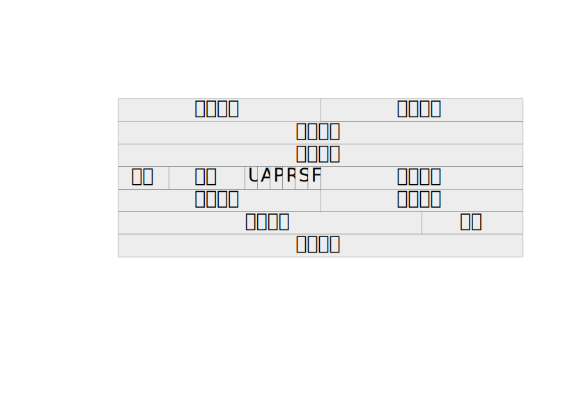
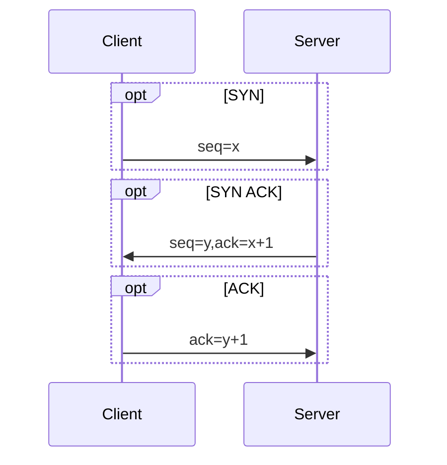
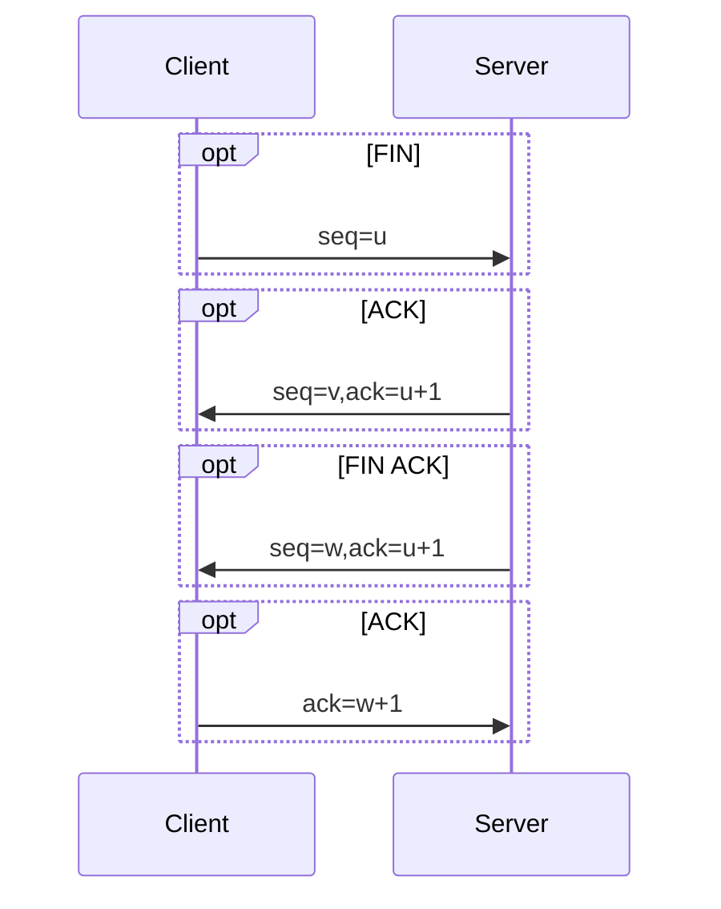

# 协议相关

## HTTP版本
* HTTP 0.9
>HTTP/0.9是第一个版本的HTTP协议，已过时。
>>组成极其简单，只允许客户端发送GET这一种请求，且不支持请求头。由于没有协议头，造成了HTTP/0.9协议只支持一种内容，即纯文本。不过网页仍然支持用HTML语言格式化，同时无法插入图片。
>>HTTP/0.9具有典型的无状态性，每个事务独立进行处理，事务结束时就释放这个连接。由此可见，HTTP协议的无状态特点在其第一个版本0.9中已经成型。
>>一次HTTP/0.9的传输首先要建立一个由客户端到Web服务器的TCP连接，由客户端发起一个请求，然后由Web服务器返回页面内容，然后连接会关闭。如果请求的页面不存在，也不会返回任何错误码。
* HTTP 1.0
>HTTP协议的第二个版本，第一个在通讯中指定版本号的HTTP协议版本，至今仍被广泛采用。
>>相对于HTTP/0.9增加了如下主要特性：
1. 请求与响应支持头域
2. 响应对象以一个响应状态行开始
3. 响应对象不只限于超文本
4. 开始支持客户端通过POST方法向Web服务器提交数据，支持GET、HEAD、POST方法
5. 支持长连接（但默认还是使用短连接），缓存机制，以及身份认证

* HTTP 1.1 
>HTTP协议的第三个版本是HTTP/1.1，是目前使用最广泛的协议版本。
>>HTTP/1.1是目前主流的HTTP协议版本，相对于HTTP/1.0新增了以下内容：
1. 默认为长连接
>>>HTTP 1.1支持长连接（PersistentConnection）和请求的流水线（Pipelining）处理，在一个TCP连接上可以传送多个HTTP请求和响应，减少了建立和关闭连接的消耗和延迟，在HTTP1.1中默认开启Connection：keep-alive，一定程度上弥补了HTTP1.0每次请求都要创建连接的缺点。
2. 提供了范围请求功能(宽带优化)
>>>HTTP1.0中，存在一些浪费带宽的现象，例如客户端只是需要某个对象的一部分，而服务器却将整个对象送过来了，并且不支持断点续传功能，HTTP1.1则在请求头引入了range头域，它允许只请求资源的某个部分，即返回码是206（Partial Content），这样就方便了开发者自由的选择以便于充分利用带宽和连接。这是支持文件断点续传的基础。
3. 提供了虚拟主机的功能(HOST域)
>>>在HTTP1.0中认为每台服务器都绑定一个唯一的IP地址，因此，请求消息中的URL并没有传递主机名（hostname）。但随着虚拟主机技术的发展，在一台物理服务器上可以存在多个虚拟主机（Multi-homed Web Servers），并且它们共享一个IP地址。HTTP1.1的请求消息和响应消息都应支持Host头域，且请求消息中如果没有Host头域会报告一个错误（400 Bad Request）。
4. 多了一些缓存处理字段
>>>HTTP/1.1在1.0的基础上加入了一些cache的新特性，引入了实体标签，一般被称为e-tags，新增更为强大的Cache-Control头。
5. 错误通知的管理
>>>在HTTP1.1中新增了24个错误状态响应码，如409（Conflict）表示请求的资源与资源的当前状态发生冲突；410（Gone）表示服务器上的某个资源被永久性的删除。
* HTTP 2.0 
>HTTP协议的第四个版本是HTTP/2.0，目前还在开发阶段
>>相对于HTTP/1.1新增了以下内容：
1. 二进制分帧
>>>HTTP 2.0 的所有帧都采用二进制编码
>>>帧：客户端与服务器通过交换帧来通信，帧是基于这个新协议通信的最小单位。
>>>消息：是指逻辑上的 HTTP 消息，比如请求、响应等，由一或多个帧组成。
>>>流：流是连接中的一个虚拟信道，可以承载双向的消息；每个流都有一个唯一的整数标识符（1、2 … N）；
2. 多路复用
>>>多路复用允许同时通过单一的HTTP/2.0 连接发起多重的请求-响应消息。有了新的分帧机制后，HTTP/2.0不再依赖多个TCP 连接去处理更多并发的请求。每个数据流都拆分成很多互不依赖的帧，而这些帧可以交错（乱序发送），还可以分优先级。最后再在另一端根据每个帧首部的流标识符把它们重新组合起来。HTTP 2.0 连接都是持久化的，而且客户端与服务器之间也只需要一个连接（每个域名一个连接）即可。
3. 头部压缩
>>>HTTP/1.1 的首部带有大量信息，而且每次都要重复发送。HTTP/2.0 要求通讯双方各自缓存一份首部字段表，从而避免了重复传输。
4. 请求优先级
>>>浏览器可以在发现资源时立即分派请求，指定每个流的优先级，让服务器决定最优的响应次序。这样请求就不必排队了，既节省了时间，也最大限度地利用了每个连接。
5. 服务端推送
>>>服务端推送能把客户端所需要的资源伴随着index.html一起发送到客户端，省去了客户端重复请求的步骤。正因为没有发起请求，建立连接等操作，所以静态资源通过服务端推送的方式可以极大地提升速度。

## HTTP 与 HTTPS
* HTTP协议
>HTTP协议(HyperText Transfer Protocol,超文本传输协议)是因特网上应用最为广泛的一种网络传输协议,所有的WWW文件都必须遵守这个标准.
>HTTP是一个基于TCP/IP通信协议来传递数据(HTML 文件,图片文件,查询结果等)

* HTTPS协议
>HTTPS(Hypertext Transfer Protocol Secure,超文本传输安全协议),是以安全为目标的HTTP通道，简单讲是HTTP的安全版.
>HTTP下加入SSL层，HTTPS的安全基础是SSL,因此加密的详细内容就需要SSL.
>>SSL协议位于TCP/IP协议与各种应用层协议之间,为数据通讯提供安全支持,分为两层:
>>>SSL记录协议(SSL Record Protocol):建立在可靠的传输协议(如TCP)之上,为高层协议提供数据封装、压缩、加密等基本功能的支持.
>>>SSL握手协议(SSL Handshake Protocol):建立在SSL记录协议之上,用于在实际的数据传输开始前,通讯双方进行身份认证、协商加密算法、交换加密密钥等.

* HTTP协议与HTTPS协议的区别
>HTTPs协议需要到ca申请证书，一般免费证书很少，需要交费。
>HTTP是超文本传输协议，信息是明文传输，HTTPs则是具有安全性的ssl加密传输协议。
>HTTP和HTTPs使用的是完全不同的连接方式，用的端口也不一样，前者是80，后者是443。
>HTTP的连接很简单，是无状态的；HTTPS协议是由SSL+HTTP协议构建的可进行加密传输、身份认证的网络协议，比HTTP协议安全。

* HTTPS的优点与缺点
| 优点 | 缺点 |
| --- | --- |
|可认证用户和服务器，确保数据发送到正确的客户机和服务器|握手阶段比较费时，会使页面加载时间延长近50%，增加10%到20%的耗电；此外，还会影响缓存，增加数据开销和功耗|
|相对安全可防止数据在传输过程中不被窃取、改变，确保数据完整性|安全是有范围的，在黑客攻击、拒绝服务攻击、服务器劫持等方面几乎无作用；且SSL证书信用链体系并不安全，特别是在某些国家可以控制CA根证书的情况下，中间人攻击一样可行|
|现行架构下最安全的解决方案，虽然不是绝对安全，但它大幅增加了中间人攻击的成本|SSL证书也需要钱，功能越强大的证书费用越高|
|谷歌曾在2014年8月份调整搜索引擎算法，并称“比起同等HTTP网站，采用HTTPS加密的网站在搜索结果中的排名将会更高”|SSL证书需要绑定IP，不能再同一个ip上绑定多个域名，ipv4资源支持不了这种消耗|

## TCP 与 UDP

* TCP报头

>源端口号和目的端口号：再加上IP首部的源IP地址和目的IP地址可以唯一确定一个TCP连接
>数据序号：表示在这个报文段中的第一个数据字节序号
>确认序号：仅当ACK标志为1时有效。确认号表示期望收到的下一个字节的序号（这个下面再详细分析）
>偏移：就是头部长度，有4位，跟IP头部一样，以4字节为单位。最大是60个字节
>保留位：6位，必须为0
>6个标志位：
>>URG-紧急指针有效
>>ACK-确认序号有效
>>PSH-接收方应尽快将这个报文交给应用层
>>RST-连接重置
>>SYN-同步序号用来发起一个连接
>>FIN-终止一个连接
>窗口字段：16位，代表的是窗口的字节容量，也就是TCP的标准窗口最大为2^16-1=65535个字节
>校验和：源机器基于数据内容计算一个数值，收信息机要与源机器数值 结果完全一样，从而证明数据的有效性。检验和覆盖了整个的TCP报文段：这是一个强制性的字段，一定是由发送端计算和存储，并由接收端进行验证的。
>紧急指针：是一个正偏移量，与序号字段中的值相加表示紧急数据最后一个字节的序号。TCP的紧急方式是发送端向另一端发送紧急数据的一种方式
>选项与填充（必须为4字节整数倍，不够补0）：
>>最常见的可选字段的最长报文大小MSS（Maximum Segment Size），每个连接方通常都在一个报文段中指明这个选项。它指明本端所能接收的最大长度的报文段。
>>该选项如果不设置，默认为536（20+20+536=576字节的IP数据报）

* TCP三次握手与四次挥手

>三次握手
>>第一次握手：建立连接时，客户端发送syn包（syn=j）到服务器，并进入SYN_SENT状态，等待服务器确认；SYN：同步序列编号（Synchronize Sequence Numbers）。
>>第二次握手：服务器收到syn包，必须确认客户的SYN（ack=j+1），同时自己也发送一个SYN包（syn=k），即SYN+ACK包，此时服务器进入SYN_RECV状态；
>>第三次握手：客户端收到服务器的SYN+ACK包，向服务器发送确认包ACK(ack=k+1），此包发送完毕，客户端和服务器进入ESTABLISHED（TCP连接成功）状态，完成三次握手。

>四次挥手
>>第一次挥手：Client发送一个FIN，用来关闭Client到Server的数据传送，Client进入FIN_WAIT_1状态。
>>第二次挥手：Server收到FIN后，发送一个ACK给Client，确认序号为收到序号+1（与SYN相同，一个FIN占用一个序号），Server进入CLOSE_WAIT状态。
>>第三次挥手：Server发送一个FIN，用来关闭Server到Client的数据传送，Server进入LAST_ACK状态。
>>第四次挥手：Client收到FIN后，Client进入TIME_WAIT状态，接着发送一个ACK给Server，确认序号为收到序号+1，Server进入CLOSED状态，完成四次挥手。

* TCP与UDP的区别
| TCP | UDP |
| --- | --- |
| 面向连接的 | 无连接的(数据改善前不需要先建立链接) |
|提供可靠的服务适合大数据量的交换(通过TCP连接传送的数据,无差错,不丢失,不重复,且按序到达)|尽最大努力交付(不保证可靠交付)|
|面向字节流|面向报文(网络出现拥塞不会使得发送速率降低)|
|只能是1对1的|支持1对1,1对多|
|首部20字节|首部8字节|
|可靠性传输|不可靠性传输|

## WebSocket
* webSocket概念
>在WebSocket概念出来之前，如果页面要不停地显示最新的价格，那么必须不停地刷新页面，或者用一段js代码每隔几秒钟发消息询问服务器数据。 
>而使用WebSocket技术之后，当服务器有了新的数据，会主动通知浏览器。 如当服务端有新的比特币价格之后，浏览器立马接收到消息。

* WebSocket 与 HTTP
>WebSocket是HTML5中的协议，支持持久连续，HTTP协议不支持持久性连接
>HTTP1.0和HTTP1.1都不支持持久性的链接，HTTP1.1中的keep-alive，将多个HTTP请求合并为1个
>>HTTP的生命周期通过Request来界定，也就是Request一个Response，那么在HTTP1.0协议中，这次HTTP请求就结束了
>>在HTTP1.1中进行了改进，是的有一个connection：Keep-alive，也就是说，在一个HTTP连接中，可以发送多个Request，接收多个Response;但是必须记住，在HTTP中一个Request只能对应有一个Response，而且这个Response是被动的，不能主动发起。

* WebSocket有什么优点？
>节约带宽。不停地轮询服务端数据这种方式，使用的是HTTP协议，head信息很大，有效数据占比低， 而使用WebSocket方式，头信息很小，有效数据占比高。
>无浪费。 轮询方式有可能轮询10次，才碰到服务端数据更新，那么前9次都白轮询了，因为没有拿到变化的数据。 而WebSocket是由服务器主动回发，来的都是新数据。
>实时性，考虑到服务器压力，使用轮询方式不可能很短的时间间隔，否则服务器压力太多，所以轮询时间间隔都比较长，好几秒，设置十几秒。 而WebSocket是由服务器主动推送过来，实时性是最高的。
