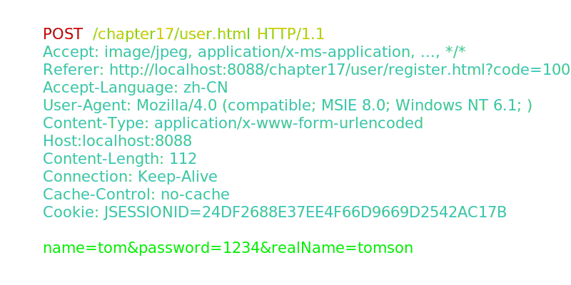

# HTTP请求

## 请求报文
HTTP请求报文由三部分组成：请求行，请求头，请求体

* 请求行：
    * 请求方法: HTTP/1.1 定义的请求方法有8种：GET、POST、PUT、DELETE、PATCH、HEAD、OPTIONS、TRACE。最常的两种GET和POST，如果是RESTful接口的话一般会用到GET、POST、DELETE、PUT。
    * 请求地址: URL:统一资源定位符，是一种自愿位置的抽象唯一识别方法。组成：<协议>：//<主机>：<端口>/<路径> 注：端口和路径有时可以省略（HTTP默认端口号是80）
    * HTTP协议版本: 协议版本的格式为：HTTP/主版本号.次版本号，常用的有HTTP/1.0和HTTP/1.1
    * PS: 分隔符以空格表示，不可省略

* 请求头：
    * 请求报头: 请求头部为请求报文添加了一些附加信息，由“名/值”对组成，每行一对，名和值之间使用冒号分隔。

* 空行：
    * PS: 请求头与请求体之间的空行不可省略

* 请求体：
    * 请求数据: 请求数据也叫主体，可以添加任意的其他数据。 