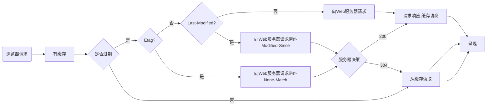

# HTTP请求

## 请求报文
HTTP请求报文由三部分组成：请求行，请求头，请求体

* 请求行：
    * 请求方法: HTTP/1.1 定义的请求方法有8种：GET、POST、PUT、DELETE、PATCH、HEAD、OPTIONS、TRACE。最常的两种GET和POST，如果是RESTful接口的话一般会用到GET、POST、DELETE、PUT。
    * 请求地址: URL:统一资源定位符，是一种自愿位置的抽象唯一识别方法。组成：<协议>：//<主机>：<端口>/<路径> 注：端口和路径有时可以省略（HTTP默认端口号是80）
    * HTTP协议版本: 协议版本的格式为：HTTP/主版本号.次版本号，常用的有HTTP/1.0和HTTP/1.1
    * PS: 分隔符以空格表示，不可省略

* 请求头：
    * 请求报头: 请求头部为请求报文添加了一些附加信息，由“名/值”对组成，每行一对，名和值之间使用冒号分隔。

* 空行：
    * PS: 请求头与请求体之间的空行不可省略

* 请求体：
    * 请求数据: 请求数据也叫主体，可以添加任意的其他数据。 

## 请求
* GET： 请求指定的页面信息，并返回实体主体。
* HEAD： 只请求页面的首部。
* POST： 请求服务器接受所指定的文档作为对所标识的URI的新的从属实体。
* PUT： 从客户端向服务器传送的数据取代指定的文档的内容。
* DELETE： 请求服务器删除指定的页面。
* OPTIONS： 允许客户端查看服务器的性能。
* TRACE： 请求服务器在响应中的实体主体部分返回所得到的内容。
* PATCH： 实体中包含一个表，表中说明与该URI所表示的原内容的区别。
* MOVE： 请求服务器将指定的页面移至另一个网络地址。
* COPY： 请求服务器将指定的页面拷贝至另一个网络地址。
* LINK： 请求服务器建立链接关系。
* UNLINK： 断开链接关系。
* WRAPPED： 允许客户端发送经过封装的请求。
* Extension-mothed：在不改动协议的前提下，可增加另外的方法。

## 缓存

>缓存分为两种：强缓存和协商缓存，根据响应的header内容来决定。
| | 获取资源形式| 状态码| 是否发送请求到服务器| 字段优先级|
| | ---| ---| ---| ---|
| 强缓存| 从缓存取| 200（from cache）| 否，直接从缓存取|pragma -> cache-control -> expires|
| 协商缓存| 从缓存取| 304（not modified）| 是，通过服务器来告知缓存是否可用| Etag/If-None-Match -> Last-Modified/If-Modified-Since|

