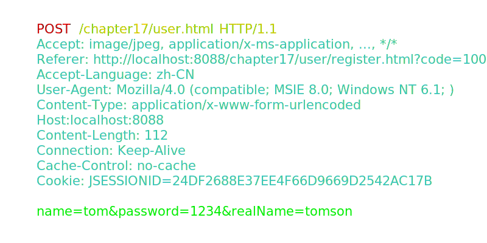
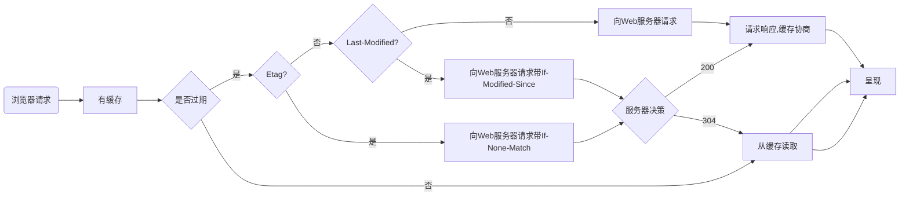
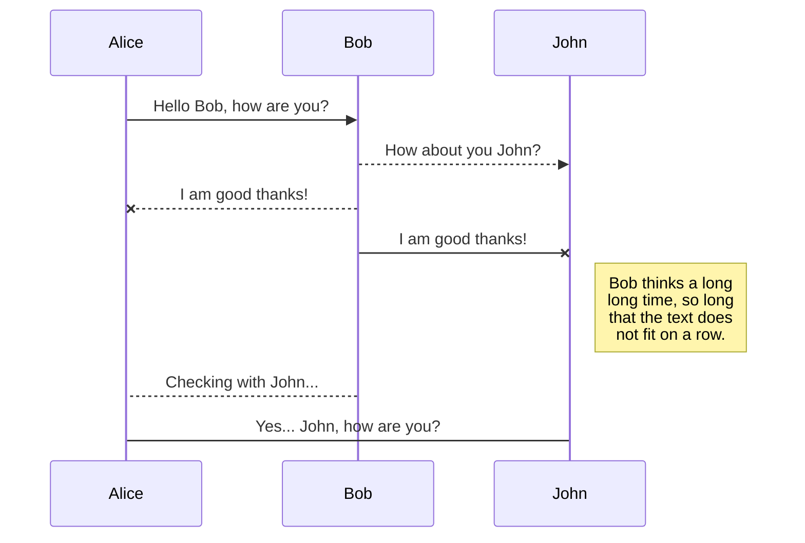

# HTTP请求

1. [请求报文](#请求报文)
2. [请求方式](#请求方式)
3. [缓存](#缓存)
4. [前端优化](#前端优化)
5. [浏览器页面生成](#浏览器页面生成)
6. [跨域](#跨域)

## 请求报文
HTTP请求报文由三部分组成：请求行，请求头，请求体

* 请求行：

1. 请求方法: HTTP/1.1 定义的请求方法有8种：GET、POST、PUT、DELETE、PATCH、HEAD、OPTIONS、TRACE。最常的两种GET和POST，如果是RESTful接口的话一般会用到GET、POST、DELETE、PUT。
2. 请求地址: URL:统一资源定位符，是一种自愿位置的抽象唯一识别方法。组成：<协议>：//<主机>：<端口>/<路径> 注：端口和路径有时可以省略（HTTP默认端口号是80）
3. HTTP协议版本: 协议版本的格式为：HTTP/主版本号.次版本号，常用的有HTTP/1.0和HTTP/1.1
4. 分隔符以空格表示，不可省略

* 请求头：

请求报头: 请求头部为请求报文添加了一些附加信息，由“名/值”对组成，每行一对，名和值之间使用冒号分隔。

* 空行：

PS: 请求头与请求体之间的空行不可省略

* 请求体：

请求数据: 请求数据也叫主体，可以添加任意的其他数据。 

## 请求方式
* 可能的请求方式
1. GET： 请求指定的页面信息，并返回实体主体。
2. HEAD： 只请求页面的首部。
3. POST： 请求服务器接受所指定的文档作为对所标识的URI的新的从属实体。
4. PUT： 从客户端向服务器传送的数据取代指定的文档的内容。
5. DELETE： 请求服务器删除指定的页面。
6. OPTIONS： 允许客户端查看服务器的性能。
7. TRACE： 请求服务器在响应中的实体主体部分返回所得到的内容。
8. PATCH： 实体中包含一个表，表中说明与该URI所表示的原内容的区别。
9. MOVE： 请求服务器将指定的页面移至另一个网络地址。
10. COPY： 请求服务器将指定的页面拷贝至另一个网络地址。
11. LINK： 请求服务器建立链接关系。
12. UNLINK： 断开链接关系。
13. WRAPPED： 允许客户端发送经过封装的请求。
14. Extension-mothed：在不改动协议的前提下，可增加另外的方法。

* GET 与 POST 的区别

| | 参数传递 | 长度限制 | 安全性 | 编码方式 | 记录缓存 |fetch请求 |
| ---| ---| ---| ---| ---| ---| ---|
| GET| 通过URL传递 | 长度有限制 | 不安全 | 只能进行URL编码 | 请求参数会被保存于浏览历史中 | 一个TCP数据包 |
| POST| 存放于request body中 |  长度无限制 | 安全 | 支持多种编码方式 | 请求参数不会被保存 | 二个TCP数据包 |

* fetch 请求
fetch的post请求的时候，fetch 第一次发送了一个Options请求，询问服务器是否支持修改的请求头，如果服务器支持(状态码204)，则在第二次中发送真正的请求。

## 缓存

* 缓存分为两种：强缓存和协商缓存，根据响应的header内容来决定。

| | 获取资源形式| 状态码| 是否发送请求到服务器| 字段优先级|
| ---| ---| ---| ---| ---|
| 强缓存| 从缓存取| 200（from cache）| 否，直接从缓存取 | pragma -> cache-control -> expires|
| 协商缓存| 从缓存取| 304（not modified）| 是，通过服务器来告知缓存是否可用| Etag/If-None-Match -> Last-Modified/If-Modified-Since|

## 前端优化

| 原理 | 实现 |
| -| -|
| 降低请求量| 合并资源，减少HTTP 请求数，minify / gzip 压缩，webP，lazyLoad。|
| 加快请求速度| 预解析DNS，减少域名数，并行加载，CDN 分发。|
| 缓存| HTTP 协议缓存请求，离线缓存 manifest，离线数据缓存localStorage。|
| 渲染| JavaScript/CSS优化，加载顺序，服务端渲染，pipeline。|

## 浏览器页面生成
* 浏览器页面生成时会构造两棵树，DOM树和CSSOM规则树:
1. 当浏览器接收到服务器相应来的HTML文档后，会遍历文档节点，生成DOM树
2. CSSOM规则树由浏览器解析CSS文件生成

## 跨域

* 什么是跨域
跨域，是指浏览器不能执行其他网站的脚本。它是由浏览器的同源策略造成的，是浏览器对JavaScript实施的安全限制，那么只要协议、域名、端口有任何一个不同，都被当作是不同的域。跨域原理，即是通过各种方式，避开浏览器的安全限制。

* 跨域的解决方案

| 方法| 实现|
|-|-|
| JSONP| 通过动态创建script，再请求一个带参网址实现跨域通信|
| document.domain + iframe| 两个页面都通过js强制设置document.domain为基础主域，就实现了同域|
| location.hash + iframe| a欲与b跨域相互通信，通过中间页c来实现。 三个页面，不同域之间利用iframe的location.hash传值，相同域之间直接js访问来通信|
| window.name + iframe| 通过iframe的src属性由外域转向本地域，跨域数据即由iframe的window.name从外域传递到本地域|
| postMessage| 可以跨域操作的window属性之一|
| CORS| 服务端设置Access-Control-Allow-Origin即可，前端无须设置，若要带cookie请求，前后端都需要设置|
| 代理跨域| 启一个代理服务器，实现数据的转发|
