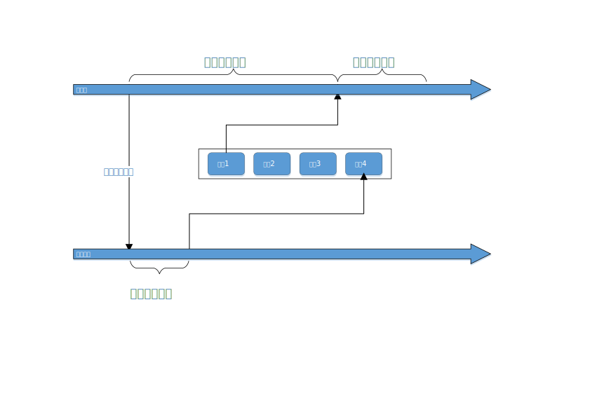
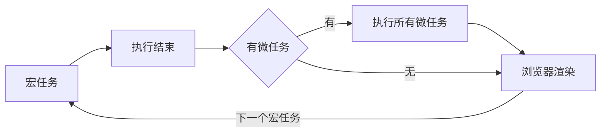

# JavaScript 执行机制

## 异步回调地狱
异步回调地狱是指代码横向增长（比如在Promise对象里面循环嵌套了多个Promise对象）而不是竖向增长。
>解决方法：
>>用Promise的 .then 写成链式结构实现竖向增长
>>使用async await
>>使用Generator协程

## 事件流
>事件
>>HTML中与javascript交互是通过事件驱动来实现的，例如鼠标点击事件onclick、页面的滚动事件onscroll等等，可以向文档或者文档中的元素添加事件侦听器来预订事件。
>"DOM2事件流"规定的事件流包括三个阶段：
>>事件捕获阶段。
>>处于目标阶段。
>>事件冒泡阶段。
>addEventListener
>>addEventListener是DOM2级事件新增的指定事件处理程序的操作，这个方法接收3个参数：
>>要处理的事件名，作为事件处理程序的函数和一个布尔值，最后这个布尔值如果是true，表示在捕获阶段调用事件处理程序；如果是false，表示在冒泡阶段调用事件处理程序。

## 事件监听
参考回答：
addEventListener()方法，用于向指定元素添加事件句柄，它可以更简单的控制事件，语法为
element.addEventListener(event, function, useCapture);

第一个参数是事件的类型(如 "click" 或 "mousedown").

第二个参数是事件触发后调用的函数。

第三个参数是个布尔值用于描述事件是冒泡还是捕获。该参数是可选的。

事件传递有两种方式，冒泡和捕获

事件传递定义了元素事件触发的顺序，如果你将P元素插入到div元素中，用户点击P元素，

在冒泡中，内部元素先被触发，然后再触发外部元素，

捕获中，外部元素先被触发，在触发内部元素，

## 事件冒泡与终止
>事件冒泡
>>事件冒泡发生的条件：当为多个嵌套的元素设置了相同的事件处理程序，它们将触发事件冒泡机制。在事件冒泡中，最内部的元素将首先触发其事件，然后是栈内的下一个元素触发该事件，以此类推，直到到达最外面的元素。如果把事件处理程序指定给所有的元素，那么这些事件将依次触发。
>冒泡终止
>>js冒泡和捕获是事件的两种行为，使用event.stopPropagation()起到阻止捕获和冒泡阶段中当前事件的进一步传播。使用event.preventDefault()可以取消默认事件。

## 事件委托
>事件委托指的是，不在事件的发生地（直接dom）上设置监听函数，而是在其父元素上设置监听函数，通过事件冒泡，父元素可以监听到子元素上事件的触发，通过判断事件发生元素DOM的类型，来做出不同的响应。
>>最经典的就是ul和li标签的事件监听，比如我们在添加事件时候，采用事件委托机制，不会在li标签上直接添加，而是在ul父元素上添加。
>>优势：比较合适动态元素的绑定，新添加的子元素也会有监听函数，也可以有事件触发机制。

## 事件循环
JavaScript包含同步任务与异步任务
>所有同步任务都在主线程上执行，形成一个执行栈（execution context stack）。
>主线程之外还存在一个"任务队列"（task queue）。每当一个异步任务运行完成在"任务队列"之中放置一个事件。
>当前同步任务执行完毕时，读取"任务队列"，将对应异步任务的等待状态结束，压入执行栈，开始执行。
>主线程不断重复上面的第三步。

一般来说，有以下四种会放入异步任务队列：
>setTimeout和setlnterval
>DOM事件
>ES6中的Promise
>Ajax异步请求

任务队列中，在每一次事件循环中，macrotask只会提取一个执行，而microtask会一直提取，直到microsoft队列为空为止。
也就是说如果某个microtask任务被推入到执行中，那么当主线程任务执行完成后，会循环调用该队列任务中的下一个任务来执行，直到该任务队列到最后一个任务为止。而事件循环每次只会入栈一个macrotask,主线程执行完成该任务后又会检查microtasks队列并完成里面的所有任务后再执行macrotask的任务。
macrotasks: setTimeout, setInterval, setImmediate, I/O, UI rendering
microtasks: process.nextTick, Promise, MutationObserver

## 微任务与宏任务
JavaScript包含同步任务与异步任务是单线程语言，但JavaScript包含同步任务与异步任务的宿主环境(比如浏览器，Node)是多线程的，宿主环境通过某种方式使得JavaScript包含同步任务与异步任务具备了异步的属性。

* 宏任务macrotask：
>优先级：主代码块 > setImmediate > MessageChannel > setTimeout/setInterval

* 微任务包括：
>优先级：process.nextTick > Promise > MutationObserver

## 图片的懒加载和预加载
>预加载：提前加载图片，当用户需要查看时可直接从本地缓存中渲染。
>懒加载：懒加载的主要目的是作为服务器前端的优化，减少请求数或延迟请求数。

>两种技术的本质：两者的行为是相反的，一个是提前加载，一个是迟缓甚至不加载。
>懒加载对服务器前端有一定的缓解压力作用，预加载则会增加服务器前端压力。

## 异步加载相关
>async属性
>>async是HTML5的新属性，该属性规定一旦脚本可用，则会异步执行（一旦下载完毕就会立刻执行）。
>>需要注意的是：async属性仅适用于外部脚本（只有在使用src属性时）。
>defer属性
>>defer属性规定是否对脚本执行进行延迟，直到页面加载为止。
>>之前只有IE的hack支持defer属性，现在H5开始全面支持defer属性。

>如果没有async和defer属性，那么浏览器会立即执行当前的JS脚本，阻塞后面的脚本；
>如果有async属性，加载和渲染后续文档的过程和当前JS的加载与执行并行进行（异步），它是乱序执行的，不管你声明的顺序如何，只要它加载完了就会执行；
>如果有defer属性，加载后续文档元素的过程和JS的加载是并行进行（异步）的，但是JS的执行在所有元素解析完成之后进行，而且它是按照加载顺序执行脚本的

## 垃圾回收机制
>标记清除（最常用的垃圾收集方式） 
>>javascript中最常用的垃圾收集方式就是标记清除。当变量进入环境时，会标记为"进入环境"，而当变量离开环境时，会标记为"离开环境"。垃圾收集器运行时会给所有存储在内存中的变量都加上标记，然后它会去掉环境中的变量以及被环境中的变量引用的变量的标记。而再次之后在被标记的变量就是被视为准备删除的变量，因为环境中的变量已经无法访问到这些变量了。最后，垃圾收集器完成内存清除工作，销毁那些带着标记的值并且回收它们所占用的内存空间。
>引用计数（不常见）
>>引用计数的含义是跟踪每个值被引用的次数。当声明了一个变量并将一个引用类型赋值给该变量时，则这个值的引用次数为1.如果同一个只又被赋给另一个变量，则该值的引用次数加1。当这个值的引用次数为0时，则说明没有办法再访问这个值了，就可以将空间回收。（我们知道IE中有一部分对象并不是原生的js对象，例如BOM,DOM中的对象就是使用C++以COM对象的形式实现的，而COM对象的垃圾收集机制就是引用计数策略，所以即便IE的js引擎是已使用标记清除来实现的，但是js访问的COM对象依然是基于引用计数策略，也就是说，只要在IE的中涉及COM对象，就会存在循环引用的问题）