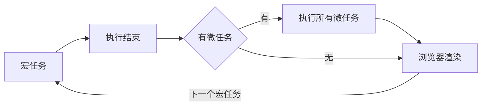

# JavaScript 执行机制

## 事件循环
JavaScript包含同步任务与异步任务
>所有同步任务都在主线程上执行，形成一个执行栈（execution context stack）。
>主线程之外还存在一个"任务队列"（task queue）。每当一个异步任务运行完成在"任务队列"之中放置一个事件。
>当前同步任务执行完毕时，读取"任务队列"，将对应异步任务的等待状态结束，压入执行栈，开始执行。
>主线程不断重复上面的第三步。

一般来说，有以下四种会放入异步任务队列：
>setTimeout和setlnterval
>DOM事件
>ES6中的Promise
>Ajax异步请求

## 微任务与宏任务
JavaScript包含同步任务与异步任务是单线程语言，但JavaScript包含同步任务与异步任务的宿主环境(比如浏览器，Node)是多线程的，宿主环境通过某种方式使得JavaScript包含同步任务与异步任务具备了异步的属性。

* 宏任务macrotask：
>优先级：主代码块 > setImmediate > MessageChannel > setTimeout/setInterval

* 微任务包括：
>优先级：process.nextTick > Promise > MutationObserver